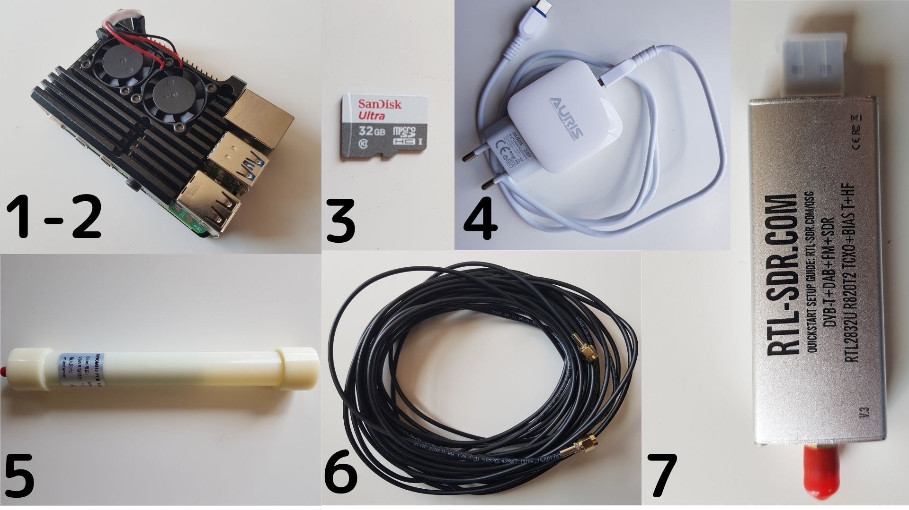
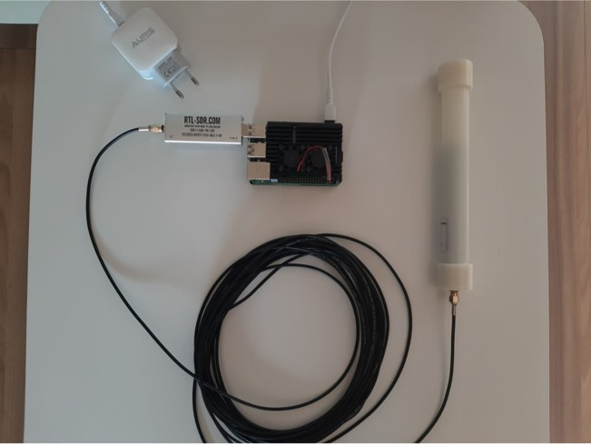
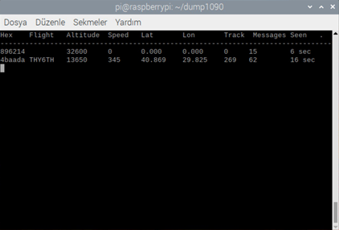
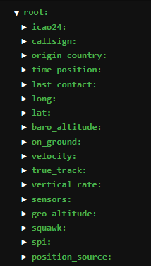
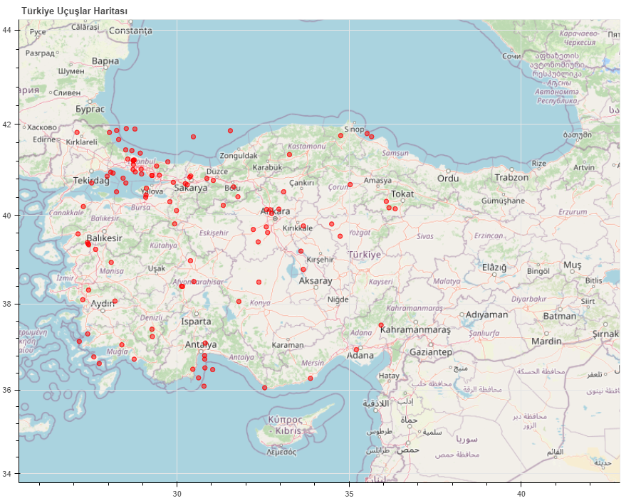
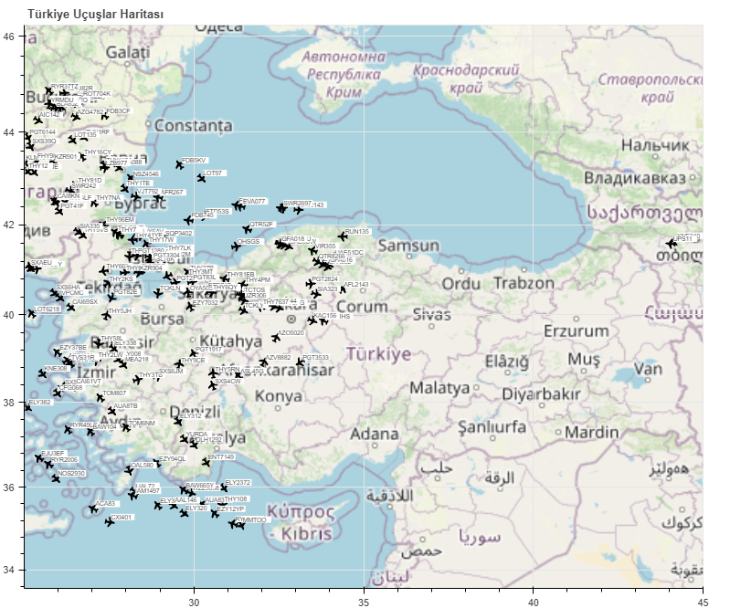
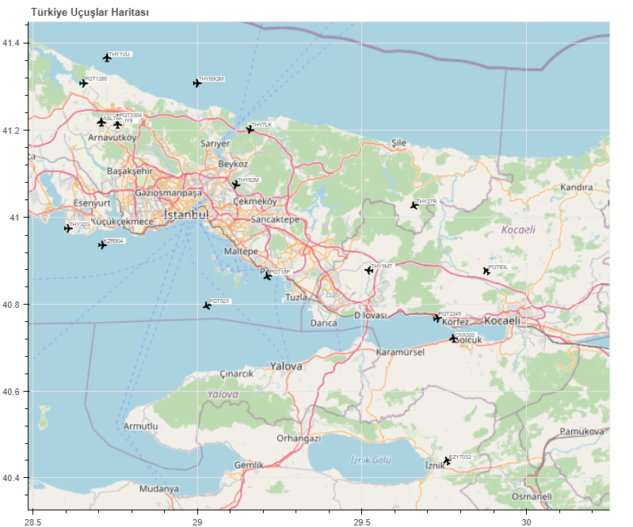
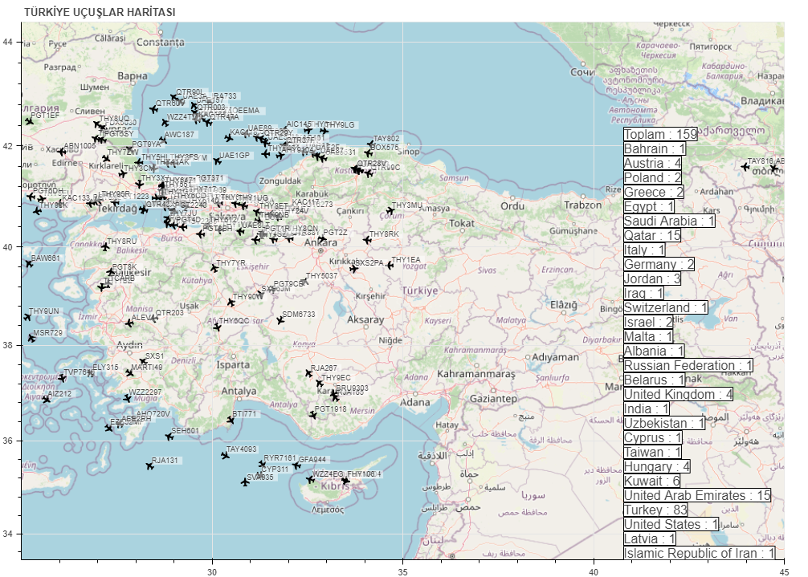
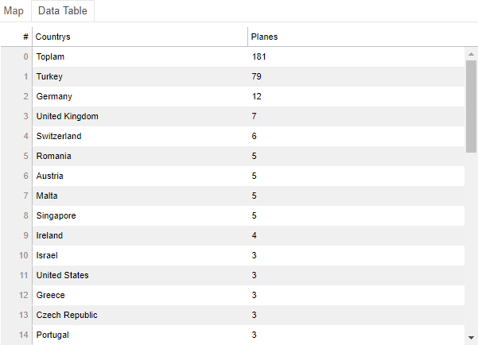
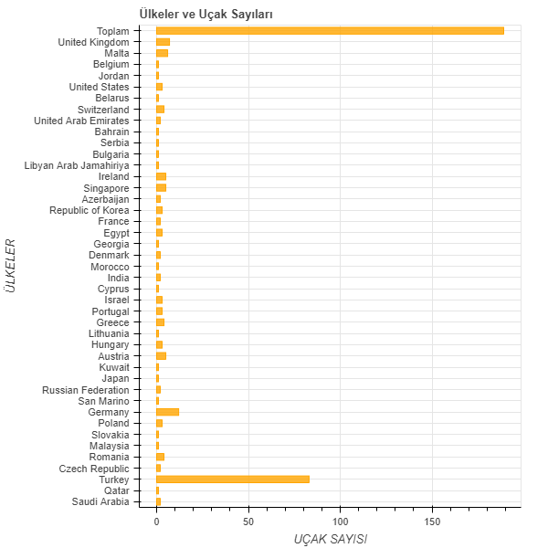

# Dinamik Türkiye Uçuşlar Haritası

## 1. ADS-B Anten Donanımı ile Uçuşlar Haritası

Konum, hız ve tanımlama gibi değişken pADS-B uydu merkezli bir gözetleme sistemidir. arametreler, Mod S Genişletilmiş Squitter (1090 MHz band) aracılığıyla iletilir (LAUFER, 2018). Günümüzde uçakların çoğu sürekli olarak ADS-B mesajları yayınlamaktadır.  

ADS-B receiver donanımından faydalanarak Python ile gerçek zamanlı Türkiye uçuşlar haritası üretmektir.  

## 1.1. ADS-B Anten Kurulumu

ADS-B anten donanımı kurulumu ve OpenSky Network’ e bağlanması hakkında çalışmalar yapılmıştır.  

Başlamadan önce antenin kurulacağı yerin belirlenmesi önemlidir. Etrafında yapı olmamalı, her tarafı açık olmalı ve gökyüzünü net bir şekilde görmelidir.  



Donanımın kurulumu için gerekli malzemeler:

1. Raspberry Pİ 4 Model B 2gb ram
2. Raspberry Pi 4 Alüminyum Çift Fanlı Muhafaza Kutusu
3. Sandisk Ultra MicroSD Card 32GB
4. Güç Adaptörü
5. ADS-B 1090 MHz anten (Dişi konnektör)
6. Rg174 Koaksiyel Kablo (Erkek-Erkek)
7. RTL-SDR alıcı



ADS-B anten parçaları tedarik edildikten sonra kurulum yapılmıştır:

1. Raspberry Pi kurulumu
2. İşletim sistemi
3. RTL-SDR alıcı sürücülerinin yüklenmesi
4. Dump1090 kurulumu




Baz istasyonunu OpenSky a bağlama:

- Raspberry için dinamik DNS kurun
- 30005 bağlantı noktasını internetten erişilebilir hale getirin
- OpenSky Network hesabı oluşturun
- OpenSky Network üzerinde yeni bir sensör yapılandırın

Raspberry Pi ile ADS-B anten kurulumu hakkında detaylı bilgi:  
[openskynetwork/raspberry-pi-adsb](https://github.com/openskynetwork/raspberry-pi-adsb)

## 2. Python Programlam Dili ile Uçuşlar Haritası

Uçak hareketlerinin dinamik olarak izlenmesi amacı ile yaptığımız çalışma aşamaları şu şekildedir :

1. Sürekli veri çekmek amacıyla Opensky Network üzerinde üyelik açılmıştır.
2. Veri yapısını anlamak ve tasarlamak için araştırmalar yapılmıştır.
3. Veri akışı ve yapısı anlaşıldıktan sonra programlamaya başlanmıştır.

## 2.1 OpenSky Network Üyelik oluşturma

Bir harita çiziminin en önemli aşaması veri toplamadır. Özellikle dinamik bir harita çizmek istiyorsanız sürekli veri kullanmanız gerekmektedir. Bunun için uçuş bilgilerinin sürekli ve açık kaynak olarak paylaşıldığı OpenSky  Network üyeliği oluşturulmuştur.

Üyelik oluşturmak için OpenSky Network adersine gidip çok basit bir şekilde üyelik oluşturabilirsiniz. Üyelik oluşturmak için bir mail adresiniz olması yeterlidir. Kullanıcı adınızı ve şifrenizi oluşturduktan sonra üyeliğiniz oluşmuş olacaktır.

## 2.2 Veri Yapısını Anlamak Ve Tasarlamak

!!Daha önceki bölümlerde!!... bölümünde... veri yapısını anlamak için yaptığımız araştırmalar bulunmaktadır. Araştırmalar sonucu veriler Pythonun JSON kütüphanesi yardımıyla alınmıştır. Karışık olarak gelen verileri düzenlemek için Pandas kütüphanesi kullanılarak düzenli bir veri yapısı oluşturulmuştur.

    <class 'pandas.core.frame.DataFrame'>
    Int64Index: 107 entries, 0 to 106
    Data columns (total 17 columns):
    #   Column           Non-Null Count  Dtype  
    ---  ------           --------------  -----  
    0   icao24           107 non-null    object 
    1   callsign         107 non-null    object 
    2   origin_country   107 non-null    object 
    3   time_position    107 non-null    int64  
    4   last_contact     107 non-null    int64  
    5   long             107 non-null    float64
    6   lat              107 non-null    float64
    7   baro_altitude    107 non-null    float64
    8   on_ground        107 non-null    bool   
    9   velocity         107 non-null    float64
    10  true_track       107 non-null    float64
    11  vertical_rate    107 non-null    float64
    12  sensors          107 non-null    object 
    13  geo_altitude     107 non-null    float64
    14  squawk           107 non-null    object 
    15  spi              107 non-null    bool   
    16  position_source  107 non-null    int64  
    dtypes: bool(2), float64(7), int64(3), object(5)
    memory usage: 13.6+ KB
    <class 'pandas.core.frame.DataFrame'>

## 2.3 Programlama Aşamaları

Kesintisiz veri akışı sağlandıktan ve veri yapısı tasarlandıktan sonra programlamaya başlamak için hazırlıklar tamamlanmıştır.Programlama daha düzenli ve hızlı ilerleyebilmek için bölümlere ayrılmıştır.

1. Statik Gösterim
2. Dinamik Gösterim
3. Ekstralar

### 2.3.1 Statik Gösterim

Bir harita üzerinde belli bir andaki uçakların konumlarını ve bilgilerini göstermeye statik gösterim denir. Dinamik haritanın basitleştirilmiş halidir ve altyapısıda denebilir. Bu yüzden ilk aşama olarak tercih edilmiştir.

Statik haritayı oluşturabilmek için Pandas,Numpy ve Bokeh kütüphaneleri çalışmaya eklenmiştir.

``` Python
    import pandas as pd
    import numpy as np

    from bokeh.plotting import figure
    from bokeh.tile_providers import get_provider, OSM
    from bokeh.io import output_notebook, show
```

Tasarlamış olduğumuz veri yapısı ile hazırlanan 'ucuslar.json' veri dosyası kullanılmıştır.




Veri içerisinde uçuşların koordinatları WGS84 olarak bulunmaktadır. Fakat haritada uçakların harita üzerinde gösterilebilmesi için WebMercator koordinat sistemine dönüştürülmelidir. Bunun için 'wgs84_to_web_mercator' fonksiyonu kullanılmıştır.

``` Python
    def wgs84_to_web_mercator(df, lon, lat):
        k = 6378137
        df["X"] = df[lon] * (k * np.pi/180.0)
        df["Y"] = np.log(np.tan((90 + df[lat]) * np.pi/360.0)) * k
        return df

    def wgs84_web_mercator_point(lon,lat):
        k = 6378137
        x= lon * (k * np.pi/180.0)
        
        y= np.log(np.tan((90 + lat) * np.pi/360.0)) * k
        return x,y
```

Statik harita oluşturulmuştur.

``` Python
    output_notebook()

    ucuslar = pd.read_json("ucuslar.json")
    ucuslar=wgs84_to_web_mercator(ucuslar,'long','lat')

    osmHarita = get_provider(OSM)

    p = figure(plot_width = 900 , plot_height = 700,
            x_range=(3600000,4000000),y_range=(4000000,5500000),
            x_axis_type="mercator",y_axis_type="mercator",
            tooltips=[("icao24", "@icao24"),("callsign","@callsign"),("origin_country","@origin_country"),("(X, Y)", "(@X,@Y)")],
            title = " Türkiye Uçuşlar Haritası ")

    p.add_tile(osmHarita)

    p.circle(x="X",y="Y",
            size = 6,
            fill_color="red",line_color="red",
            fill_alpha = 0.5,
            source=ucuslar)

    show(p) 
```

Oluşturulan haritada altlık olarak OpenStreetMap ve uçakları temsilen kırmızı daireler kullanılmıştır.İmleç uçakların üstüne geldiğinde uçağın icao24 kodu, çağrı adı, ülkesi ve koordinatlarını göstermektedir.



### 2.3.2 Dinamik Gösterim

Bir harita üzerinde uçakların konumlarını ve bilgilerini sürekli olarak göstermeye dinamik gösterim denir. Uçakların konumları güncel olarak değişmektedir ve sürekli olarak harita üzerinde hareket halindedirler.

Dinamik haritayı oluşturabilmek için Pandas, Numpy, Bokeh ve Request kütüphaneleri projeye eklenmiştir.

``` Python
    import requests
    import json
    import pandas as pd
    from bokeh.plotting import figure
    from bokeh.models import LabelSet, ColumnDataSource
    from bokeh.tile_providers import get_provider, OSM
    import numpy as np
    from bokeh.io import output_notebook, show
    from bokeh.layouts import layout
```

Veri için bu sefer herhangi bir veri dosyası kullanılmamıştır. Request kütüphanesi kullanılarak Rest API den sürekli olarak veri çekilmektedir ve aynı zamanda düzenlenip işlenerek kullanılmaktadır.

Veri düzenleme işlemleri için df_format fonksiyonu oluşturulmuştur. df_format, API den karmaşık şekilde gelen yanıtı düzenlemek için oluşturulmuştur. Veri yapısı tasarlanan şekilde düzenlenmiştir. Sütun adları tanımlanmıştır. Wgs84 koordinat sisteminden web mercator koordinat sistemine geçilmiştir ve Web Mercator koordinatları yeni sütunlara atanmıştır. Düzenlenen veriyi DataFrame olarak döndürür.

``` Python
    #Requestle çekilen veriyi DataFrame kullanarak uygun formata getirmek için fonksiyon
    def df_format(response):
        
        #Sütun isimleri 
        col_name = ['icao24','callsign','origin_country','time_position','last_contact',
                'long','lat','baro_altitude','on_ground','velocity',       
                'true_track','vertical_rate','sensors','geo_altitude','squawk','spi',
                'position_source']
        
        #Pandas.DataFrame kullanılarak veri düzenlendi
        df = pd.DataFrame(response) #Yanıt içindeki "states" df ye tanımlandı
        df = df.loc[:,0:16] #df tümsatırları alındı ve 17 sütuna ayrıldı
        df.columns = col_name #Tanımlanan sütun isimleri eklendi
        wgs84_to_web_mercator(df,"long","lat") #wgs84 ten mercator dönüşümü yapıldı. X ve Y sütunları
        df = df.fillna("No Data") #NaN değerleri No Data olarak değiştirildi.
        df["rot_angle"] = (df["true_track"]*-1)+45 #icon açısı için rot_angle oluşturuldu.
        df["url"] = icon_url #icon tanımlandı
        list_str = []
        for i in df["baro_altitude"]:
            list_str.append(str(i)+" m")
        df["str_altitude"] = list_str
        return df
```

Gerçek zamanlı haritayı oluşturmak için flights_map fonksiyonu, verileri güncellemek için ise fonksiyonun içinde bulunan update fonksiyonu oluşturuldu.

``` Python
    def flights_map(doc):
        
        #Veri kaynağı parametrelerini düzgün bir şekilde almak için ColumnDataSource kullanıldı.
        url_source = ColumnDataSource({
            'icao24':[],'callsign':[],'origin_country':[],
            'time_position':[],'last_contact':[],'long':[],'lat':[],
            'baro_altitude':[],'str_altitude':[],'on_ground':[],'velocity':[],'true_track':[],
            'vertical_rate':[],'sensors':[],'geo_altitude':[],'squawk':[],'spi':[],
            'position_source':[],'X':[],'Y':[],'rot_angle':[],'url':[] })

        #ColumnDataSource verilerini güncellemek için fonksiyon
        def update():
            
            response = requests.get(url).json() 
            response = response["states"]      
            url_data = df_format(response) #Uçuş haritası için gerekli format     

            #url_source verilerini güncellemek için .stream kullanılıyor
            n_roll=len(url_data.index)
            url_source.stream(url_data.to_dict(orient="list"),n_roll)
        
            url_source.data
            
        #update fonksiyonunu 5 saniye aralıklarla çalıştırıyor.
        doc.add_periodic_callback(update,5000)

        #Harita için Figure oluşturuluyor.
        p_map = figure(plot_width = FIGURE_W, plot_height = FIGURE_H,
                x_range=x_range,y_range=y_range,
                x_axis_type="mercator",y_axis_type="mercator", sizing_mode="scale_width",
                tooltips=[("Call Sign","@callsign"),("Country","@origin_country"),("Barometric Altitude", "@str_altitude")]
                )

        # Uçak ikonu ekleniyor.
        p_map.image_url(url="url", x="X", y="Y", source=url_source,
                    anchor="center", angle_units="deg",angle="rot_angle",
                    h_units="screen",w_units="screen",h=IMAGE_H,w=IMAGE_W)
        p_map.circle(x="X",y="Y",size = 10,fill_color="red",line_color="red",
                    fill_alpha = 0,line_width=0,source=url_source)

        #Etiket olarak uçak çağrı adları tanımlanıyor.
        labels = LabelSet(x = "X", y = "Y", text ="callsign", level="glyph",  
                    x_offset=2, y_offset=2, source=url_source, render_mode='canvas',
                    background_fill_color='white',text_font_size="5pt")

        osmHarita = get_provider(OSM) #Altlık 
        p_map.add_tile(osmHarita) #Altlık ekleme
        p_map.add_layout(labels)  #Çağrı adları yazan label ekleniyor 
        p_map.title = " Türkiye Uçuşlar Haritası " #Başlık
        
        doc.add_root(p_map)    
```

Dinamik harita oluşturulmuştur.

``` Python
    output_notebook()

    #API için kullanıcı adı ve şifre, çalışma alanı sınırları
    user_name = ""
    password = ""

    #Kod içinde sınır için kullanılan sayısal veriler.
    #Uçuş sınırları
    lon_min,lat_min = 25,35 
    lon_max,lat_max = 45,45
    #Harita boyutları
    FIGURE_W = 1200
    FIGURE_H = 1000
    #İkon boyutları
    IMAGE_H = 10
    IMAGE_W = 10

    url = "https://{}:{}@opensky-network.org/api/states/all?lamin={}&lomin={}&lamax={}&lomax={}".format(user_name,password,lat_min,lon_min,lat_max,lon_max)
    icon_url = "https://iconvulture.com/wp-content/uploads/2017/12/plane.svg?1648292982753" 

    #Nokta koordinat dönüşümü icon için
    xy_min=wgs84_web_mercator_point(lon_min,lat_min)
    xy_max=wgs84_web_mercator_point(lon_max,lat_max)

    x_range = [xy_min[0],xy_max[0]]
    y_range = [xy_min[1],xy_max[1]]

    show(flights_map)
```

Oluşturulan dinamik haritada altlık olarak OpenStreetMap kullanılmıştır. Uçaklar için bu kez uçak ikonu kullanılmıştır. İkonların yönleri uçakların hareket yönüne göre ayarlanmıştır. Uçakların üstünde görünen etiketlerde çağrı adları yazmaktadır. İmleç ile uçak ikonlarının üzerine gelindiğinde ise çağrı adı, ülkesi ve metre cinsinden barometrik yükseklik bilgileri çıkmaktadır. Uçaklar 5 saniyelik aralıklarla haritada üzerinde hareket etmektedir.





### 2.3.3 İstatistik Bilgiler

Dinamik harita oluşturulduktan sonra basit analizler yapılmıştır. İlk olarak harita Türkiye hava sahasında bulunan uçakların anlık olarak sayısı, hangi ülkeden kaç uçağın bulunduğu yazdırıldı. Bu istatistikler aynı zamanda bir veri tablosunda büyükten küçüğe sıralı şekilde gösterildi. Harita ve veri tablosu iki ayrı sekme içinde gösterildi.





Belirli bir zaman için Türkiye hava sahasında bulunan uçakların toplam sayısı ve hangi ülkeden kaç uçağın bulunduğunu gösteren grafikler oluşturuldu. İmleç barların üzerenine getirildiğinde uçak sayısı bilgisi verilmektedir.



Belirli bir zamanda uçaklar yüksekliklerine göre filtrelenmiştir. Yüksekliklerine göre farklı renklerde dairelerle gösterilmiştir. İmleç ile üzerine gelindiğinde çağrı adları, ülkeleri ve barometrik yükseklikleri görüntülenmektedir.


